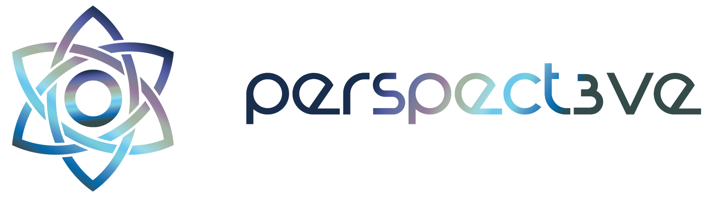

# Perspect3ve - The general purpose AD4M UI, browser and group collaboration tool

**WIP and under heavy development**

This is an agent-centric browser, a malleable social network and 
a generic UI developed close to the concepts of AD4M. As such, it provides means for creating Perspectives and creating and linking expressions inside these Perspectives.

One central intention with this tool is to make the concepts of AD4M accessible graphically and in a generic way to the user directly.

While other AD4M apps may provide a more specific interface to the user's Perspectives, the same data can always be viewed in a generic way through Perspect3ve.

Since AD4M already includes group semantics and spaces on a low level as Neighbourhoods, Perspect3ve is also a very generic social app and group collaboration tool.

Interpreting a Neighbourhood's Social DNA and adapting its UI accordingly,
Perspect3ve can be turned into any specific app, tailor-made for a group's
needs.

## Features

- [x] CRUD Perspectives
- [x] Graph based Perspective view
- [x] Creation and linking of Expressions
- [x] Publishing of Perspectives as Neighbourhoods
- [x] Joining of Neighbourhoods
- [ ] CRUD for Social DNA Prolog rules
- [ ] CRUD for custom Expression actions
- [X] AI chat for Social DNA creation (MVP) 
- [ ] Filtering of Expressions through predicate `hiddenExpression(X)`
- [ ] Custom Icons (Expression widget replacement)
- [ ] Virtual Icons (widgets representing graph patterns)
- [ ] Peer/Friends view
- [ ] Direct messaging with Peers/Friends
- [ ] "Canonical" Neighbourhood view
- [ ] CRUD Social Organisms


## Build

```
yarn
yarn build
```
or
```
npm install
npm run build
```


## Run

```
yarn dev
```

or

```
npm run dev
```

